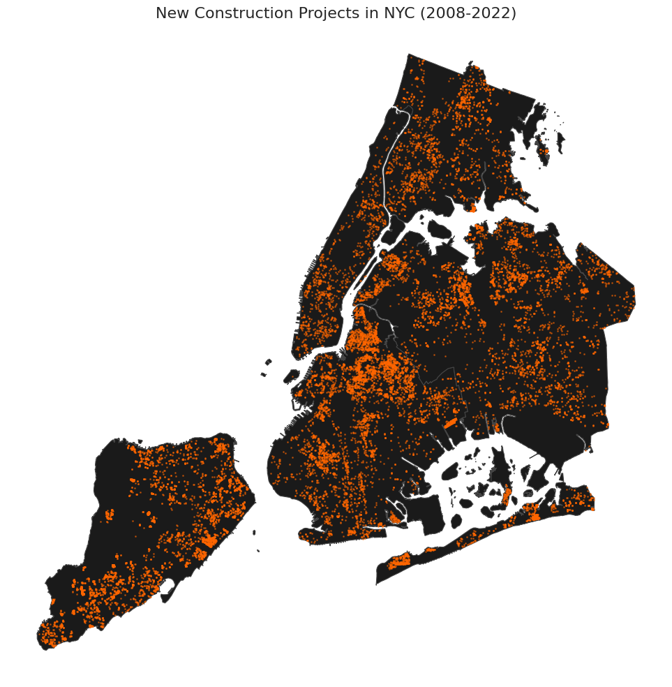
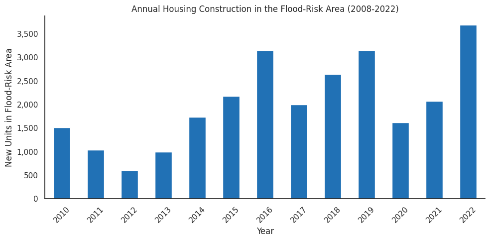
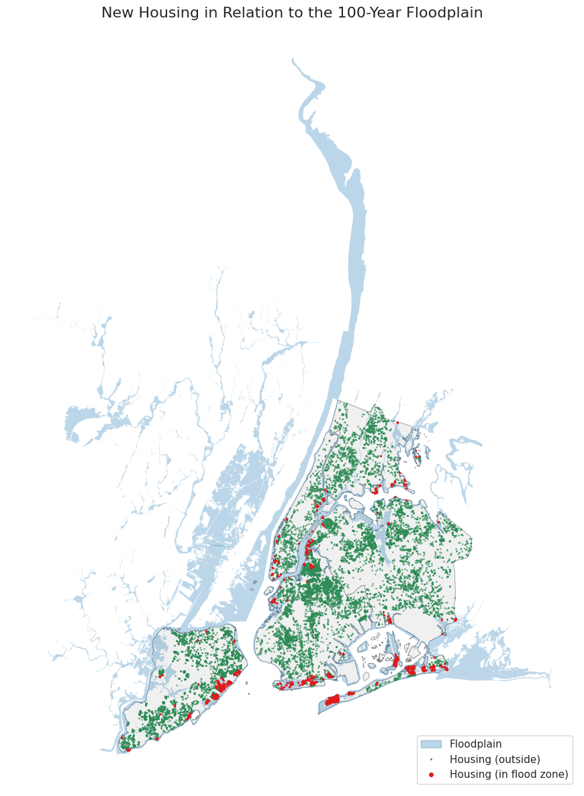
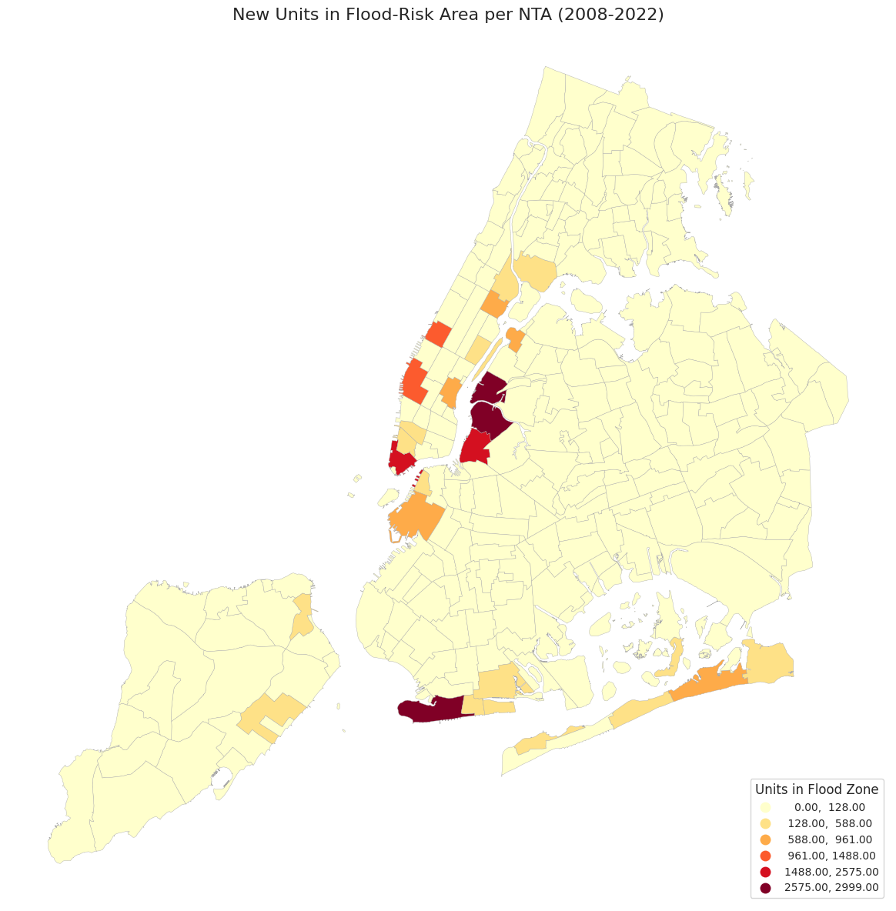
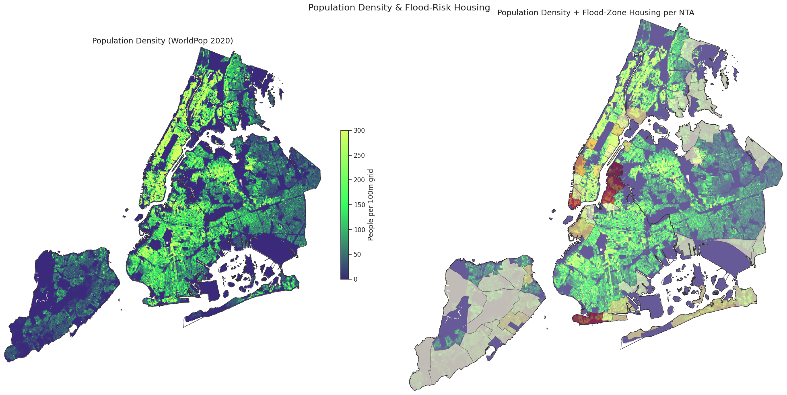

**Note:** Due to the size of the notebook, the notebook cannot be added to this repo. Please access this Colab for code: https://colab.research.google.com/drive/16kaNlGPO1fz-e48Ro15-kZVfzKYXAcS_?usp=sharing

 

# Housing Analysis in NYC's Floodplain

A spatial look at where new housing was built in New York City (2008-2022) and how much of that growth occurred inside FEMA's 100-year flood-risk areas.

## Short narrative

From 2008 to 2022, NYC added substantial housing, with a notable share located inside FEMA-mapped 100-year flood-risk zones. Floodplain development is concentrated in a small set of waterfront neighborhoods rather than evenly spread across the city. This pattern highlights the need to align housing growth with resilience investments in high-exposure corridors.

## Key findings

- Total new housing projects: **19,893**
- Total new units: **320,959**
- Projects in floodplain: **1,677**
- Units in floodplain: **26,421**
- Share of new units in floodplain: **8.23%**

## Housing development overview (2008-2022)

### New construction locations citywide

### Annual housing production trend

## Housing in flood-risk areas

### Side-by-side comparison: housing vs floodplain

### New units located in flood-risk zones

## Neighborhoods with highest exposure

### Top 5 NTAs by units in flood-risk area

| Neighborhood (NTA) | Flood-zone units |
|---|---:|
| Long Island City-Hunters Point | 2,999 |
| Greenpoint | 2,856 |
| Coney Island-Sea Gate | 2,803 |
| Williamsburg | 2,575 |
| Financial District-Battery Park City | 2,471 |

### Top 5 NTAs by total new units

| Neighborhood (NTA) | Total new units |
|---|---:|
| Long Island City-Hunters Point | 17,927 |
| Chelsea-Hudson Yards | 14,751 |
| Hell's Kitchen | 13,820 |
| Williamsburg | 12,424 |
| Downtown Brooklyn-DUMBO-Boerum Hill | 11,577 |

## Population density context

Population density helps identify where flood-risk housing overlaps with areas of higher resident concentration.

## Takeaways

- Roughly **1 in 12** newly built NYC units were in mapped 100-year flood-risk zones.
- Flood-zone housing production is concentrated in a few neighborhoods, especially along waterfront areas.
- Housing production strategy and climate adaptation planning should be coordinated in high-growth, high-risk locations.

## Data and method notes

- Housing: NYC open housing/new construction records (2008-2022 window used in notebook).
- Flood risk: FEMA Special Flood Hazard Area (100-year floodplain).
- Geography: NYC borough and NTA boundaries.
- Analysis: spatial joins of housing points to flood polygons and NTA polygons; time series and choropleth summaries.

